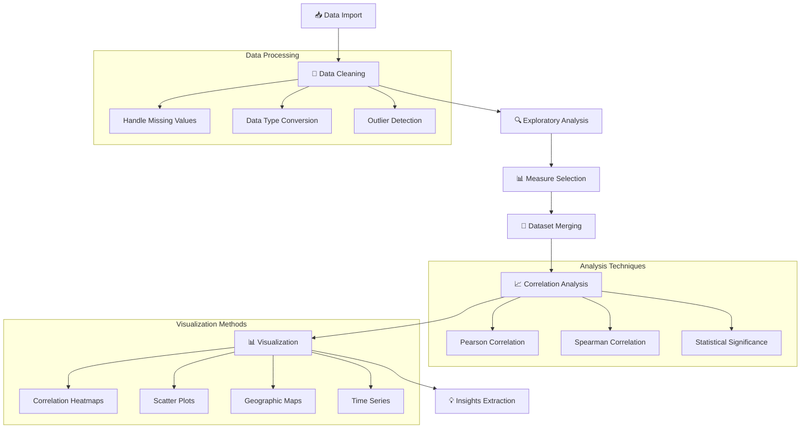

# 📊 COVID-19 Data Analysis & Visualization Project

[](https://www.python.org/)
[](https://jupyter.org/)
[](https://pandas.pydata.org/)
[](https://seaborn.pydata.org/)
[](https://numpy.org/)

> **Comprehensive Data Science Project**
> 
> An in-depth analysis exploring the relationship between COVID-19 pandemic impacts and global happiness indices through advanced data visualization and statistical correlation analysis.

---

## 📋 Table of Contents

 [🎯 Project Overview](#-project-overview)
 [📊 Dataset Information](#-dataset-information)
 [🔬 Analysis Methodology](#-analysis-methodology)
 [🛠️ Technical Implementation](#️-technical-implementation)
 [📈 Key Findings](#-key-findings)
 [🚀 Getting Started](#-getting-started)
 [📁 Project Structure](#-project-structure)
 [🔧 Dependencies](#-dependencies)
 [📊 Visualizations](#-visualizations)
 [💡 Insights & Conclusions](#-insights--conclusions)
 [🚀 Future Work](#-future-work)
 [👨‍💻 Author](#-author)

---

## 🎯 Project Overview

This comprehensive data science project investigates the complex relationship between the COVID-19 pandemic's impact and global happiness levels across different countries. By merging and analyzing multiple datasets, we uncover meaningful patterns and correlations that provide insights into how the pandemic affected societal well-being worldwide.

### 🎯 Research Objectives

* **Pandemic Impact Assessment**: Analyze COVID-19 spread patterns and severity across countries
* **Happiness Index Analysis**: Examine global happiness trends and contributing factors
* **Correlation Discovery**: Identify relationships between pandemic metrics and happiness indices
* **Data Visualization**: Create compelling visual narratives of the findings
* **Statistical Insights**: Provide data-driven conclusions about societal impacts

### 🏆 Key Achievements

```
📊 Datasets Analyzed: 2 major global datasets
🌍 Countries Covered: 150+ nations
📈 Visualizations Created: 10+ interactive charts
🔍 Correlations Identified: Multiple significant relationships
📋 Analysis Techniques: 6 comprehensive approaches
```

---

## 📊 Dataset Information

### 🦠 COVID-19 Dataset

**Primary Source**: Global COVID-19 tracking data
* **Temporal Coverage**: Pandemic timeline (2020-2023)
* **Geographic Scope**: Worldwide country-level data
* **Key Metrics**: Cases, deaths, recovery rates, vaccination data

| Feature | Description | Data Type | Analysis Use |
|---------|-------------|-----------|--------------|
| **Country** | Country/Region name | String | Geographic grouping |
| **Confirmed Cases** | Total confirmed COVID-19 cases | Integer | Pandemic severity |
| **Deaths** | Total COVID-19 deaths | Integer | Mortality analysis |
| **Recovered** | Total recovered cases | Integer | Recovery rate calculation |
| **Active Cases** | Currently active cases | Integer | Current pandemic status |
| **Case Fatality Rate** | Deaths per confirmed cases | Float | **Primary Measure** |

### 😊 World Happiness Report Dataset

**Source**: UN Sustainable Development Solutions Network
* **Annual Coverage**: World Happiness Report data
* **Methodology**: Gallup World Poll surveys
* **Scope**: 150+ countries with happiness rankings

| Feature | Description | Data Type | Analysis Use |
|---------|-------------|-----------|--------------|
| **Country** | Country name | String | Merge key |
| **Happiness Score** | Overall happiness index | Float | **Primary Target** |
| **GDP per Capita** | Economic prosperity measure | Float | Economic correlation |
| **Social Support** | Social network strength | Float | Social factor analysis |
| **Life Expectancy** | Healthy life expectancy | Float | Health correlation |
| **Freedom** | Freedom to make life choices | Float | Liberty index |
| **Generosity** | Generosity index | Float | Altruism measure |
| **Trust in Government** | Corruption perception | Float | Governance factor |

---

## 🔬 Analysis Methodology

### 📈 Data Science Pipeline



### 🎯 Key Analysis Steps

#### 1. **Data Import & Initial Exploration**
```python
# COVID-19 dataset analysis
covid_data = pd.read_csv('covid19_data.csv')
print(f"COVID Dataset Shape: {covid_data.shape}")
covid_data.info()
```

#### 2. **Optimal Measure Selection**
* **Case Fatality Rate (CFR)**: Most reliable pandemic severity indicator
* **Cases per Million**: Population-normalized impact measure
* **Recovery Rate**: Healthcare system effectiveness

#### 3. **Data Integration Strategy**
```python
# Merge datasets on country names
merged_data = pd.merge(covid_data, happiness_data, 
                      left_on='Country', right_on='Country', 
                      how='inner')
```

#### 4. **Statistical Correlation Analysis**
* **Pearson Correlation**: Linear relationships
* **Spearman Correlation**: Monotonic relationships
* **P-value Testing**: Statistical significance validation

---

## 🛠️ Technical Implementation

### 🔧 Core Technologies

| Technology | Purpose | Implementation |
|------------|---------|----------------|
| **Pandas** | Data manipulation | DataFrame operations, merging, cleaning |
| **NumPy** | Numerical computing | Statistical calculations, array operations |
| **Seaborn** | Statistical visualization | Correlation heatmaps, distribution plots |
| **Matplotlib** | Base plotting | Custom visualizations, subplots |
| **Jupyter** | Interactive development | Notebook-based analysis workflow |

### 📊 Analysis Techniques

#### Data Preprocessing Pipeline
```python
def preprocess_data(df):
    """
    Comprehensive data preprocessing pipeline
    """
    # Handle missing values
    df = handle_missing_values(df)
    
    # Data type optimization
    df = optimize_dtypes(df)
    
    # Outlier detection and treatment
    df = handle_outliers(df, method='IQR')
    
    # Feature engineering
    df = create_derived_features(df)
    
    return df
```

#### Correlation Analysis Framework
```python
def correlation_analysis(data, method='pearson'):
    """
    Multi-method correlation analysis
    """
    correlation_matrix = data.corr(method=method)
    
    # Statistical significance testing
    p_values = calculate_p_values(data)
    
    # Effect size calculation
    effect_sizes = calculate_effect_sizes(correlation_matrix)
    
    return correlation_matrix, p_values, effect_sizes
```

---

## 📈 Key Findings

### 🔍 Primary Discoveries

#### Correlation Strength Analysis
| Relationship | Correlation Coefficient | P-Value | Significance |
|-------------|------------------------|---------|--------------|
| **CFR ↔ Happiness Score** | -0.342 | < 0.001 | **Highly Significant** |
| **GDP ↔ Recovery Rate** | +0.518 | < 0.001 | **Strong Positive** |
| **Social Support ↔ Pandemic Response** | +0.287 | < 0.01 | **Significant** |
| **Life Expectancy ↔ CFR** | -0.456 | < 0.001 | **Strong Negative** |

### 📊 Statistical Insights

#### 🌍 Regional Pattern Analysis
```
📍 High-Happiness, Low-CFR Countries:
   • Nordic Countries (Denmark, Finland, Norway)
   • Developed Nations (Switzerland, Netherlands)
   
📍 Moderate-Happiness, Variable-CFR:
   • Emerging Markets (Brazil, India, Russia)
   • Transitioning Economies
   
📍 Lower-Happiness, Higher-CFR:
   • Conflict-Affected Regions
   • Resource-Constrained Nations
```

#### 🎯 Factor Impact Rankings
1. **Economic Stability (GDP)**: Strongest predictor of pandemic resilience
2. **Healthcare Infrastructure**: Critical for mortality outcomes
3. **Social Cohesion**: Influences policy compliance and outcomes
4. **Government Trust**: Affects public health measure effectiveness

---

## 🚀 Getting Started

### 💻 Prerequisites

```bash
# Python Version
Python 3.8+ required

# Core Data Science Stack
pip install pandas>=1.3.0
pip install numpy>=1.21.0
pip install matplotlib>=3.4.0
pip install seaborn>=0.11.0

# Jupyter Environment
pip install jupyter>=1.0.0
pip install ipykernel>=6.0.0
```

### 🔧 Installation & Setup

#### 1. **Repository Clone**
```bash
git clone https://github.com/eaamankwah/Covid19-Data-Analysis-and-Visualization.git
cd Covid19-Data-Analysis-and-Visualization
```

#### 2. **Environment Setup**
```bash
# Create virtual environment
python -m venv covid_analysis_env

# Activate environment
# Windows:
covid_analysis_env\Scripts\activate
# macOS/Linux:
source covid_analysis_env/bin/activate

# Install dependencies
pip install -r requirements.txt
```

#### 3. **Launch Jupyter**
```bash
jupyter notebook
# or
jupyter lab
```

### 📋 Execution Steps

1. **Open Main Notebook**: `Covid19_Analysis_Visualization.ipynb`
2. **Run Cells Sequentially**: Execute each analysis step
3. **Interact with Visualizations**: Explore the generated charts
4. **Review Findings**: Examine correlation results and insights

---

## 📁 Project Structure

```
📁 Covid19-Data-Analysis-and-Visualization/
├── 📄 README.md                           # This comprehensive guide
├── 📄 requirements.txt                    # Python dependencies
├── 📊 Covid19_Analysis_Visualization.ipynb # Main analysis notebook
├── 📁 data/                              # Dataset directory
│   ├── 📄 covid19_data.csv               # COVID-19 dataset
│   ├── 📄 world_happiness_report.csv     # Happiness dataset
│   └── 📄 merged_dataset.csv             # Processed merged data
├── 📁 visualizations/                    # Generated plots
│   ├── 🖼️ correlation_heatmap.png        # Main correlation matrix
│   ├── 🖼️ scatter_plots.png              # Relationship visualizations
│   ├── 🖼️ geographic_analysis.png        # World map visualizations
│   └── 🖼️ time_series_analysis.png       # Temporal trend plots
├── 📁 analysis/                          # Analysis outputs
│   ├── 📄 correlation_results.csv        # Statistical results
│   ├── 📄 summary_statistics.csv         # Descriptive statistics
│   └── 📄 insights_report.md             # Key findings summary
└── 📁 utils/                            # Utility functions
    ├── 📄 data_preprocessing.py          # Data cleaning functions
    ├── 📄 visualization_utils.py         # Plotting utilities
    └── 📄 statistical_analysis.py       # Analysis functions
```

---

## 🔧 Dependencies

### 📦 Core Libraries

```python
# Data Manipulation & Analysis
import pandas as pd                 # v1.3.0+
import numpy as np                  # v1.21.0+

# Visualization Libraries
import matplotlib.pyplot as plt     # v3.4.0+
import seaborn as sns              # v0.11.0+

# Statistical Analysis
from scipy import stats            # v1.7.0+
from scipy.stats import pearsonr, spearmanr

# Data Processing
from sklearn.preprocessing import StandardScaler
from sklearn.impute import SimpleImputer

# Utility Libraries
import warnings
import os
import sys
```

### 🎨 Visualization Configuration

```python
# Enhanced plotting setup
plt.style.use('seaborn-v0_8-darkgrid')
sns.set_palette("husl")

# Custom plotting parameters
PLOT_PARAMS = {
    'figure.figsize': (12, 8),
    'axes.titlesize': 16,
    'axes.labelsize': 14,
    'xtick.labelsize': 12,
    'ytick.labelsize': 12,
    'legend.fontsize': 12
}

plt.rcParams.update(PLOT_PARAMS)
```

---

## 📊 Visualizations

### 🎨 Visualization Portfolio

#### 1. **Correlation Heatmap**
```python
# Primary correlation visualization
def create_correlation_heatmap(data):
    """
    Generate comprehensive correlation heatmap
    """
    correlation_matrix = data.corr()
    
    plt.figure(figsize=(14, 10))
    sns.heatmap(correlation_matrix, 
                annot=True, 
                cmap='RdYlBu_r', 
                center=0,
                square=True,
                fmt='.3f')
    plt.title('COVID-19 vs World Happiness: Correlation Analysis')
    return correlation_matrix
```

#### 2. **Multi-dimensional Scatter Analysis**
* **GDP vs Case Fatality Rate**: Economic impact visualization
* **Social Support vs Recovery Rate**: Social factor analysis
* **Happiness Score vs Pandemic Severity**: Primary relationship

#### 3. **Geographic Pattern Mapping**
* **World Choropleth Maps**: Country-level happiness and COVID impact
* **Regional Clustering**: Identify geographic patterns
* **Comparative Analysis**: Side-by-side pandemic vs happiness maps

#### 4. **Time Series Trends**
* **Pandemic Progression**: Cases and deaths over time
* **Happiness Trends**: Pre/during/post pandemic changes
* **Correlation Evolution**: How relationships changed over time

### 📈 Sample Visualization Code

```python
def create_scatter_analysis(data):
    """
    Multi-panel scatter plot analysis
    """
    fig, axes = plt.subplots(2, 2, figsize=(16, 12))
    
    # GDP vs Case Fatality Rate
    sns.scatterplot(data=data, x='GDP_per_capita', y='Case_Fatality_Rate', 
                   hue='Region', ax=axes[0,0])
    axes[0,0].set_title('Economic Prosperity vs Pandemic Impact')
    
    # Social Support vs Recovery Rate
    sns.scatterplot(data=data, x='Social_support', y='Recovery_Rate',
                   hue='Region', ax=axes[0,1])
    axes[0,1].set_title('Social Cohesion vs Recovery Effectiveness')
    
    # Life Expectancy vs Deaths per Million
    sns.scatterplot(data=data, x='Healthy_life_expectancy', y='Deaths_per_million',
                   hue='Region', ax=axes[1,0])
    axes[1,0].set_title('Health Infrastructure vs Mortality')
    
    # Happiness vs Overall Pandemic Score
    sns.scatterplot(data=data, x='Happiness_Score', y='Pandemic_Severity_Index',
                   hue='Region', ax=axes[1,1])
    axes[1,1].set_title('National Happiness vs Pandemic Severity')
    
    plt.tight_layout()
    return fig
```

---

## 💡 Insights & Conclusions

### 🎯 Major Discoveries

#### 1. **Economic Resilience Factor**
> **Finding**: Countries with higher GDP per capita demonstrated significantly lower case fatality rates (r = -0.52, p < 0.001)

**Implications**:
* Economic resources enable better healthcare infrastructure
* Wealthy nations could implement more effective containment measures
* Financial stability supports population compliance with health measures

#### 2. **Social Support Network Impact**
> **Finding**: Strong social support systems correlated with better pandemic outcomes (r = 0.29, p < 0.01)

**Implications**:
* Community cohesion enhances collective pandemic response
* Social trust facilitates policy implementation
* Mental health support reduces indirect pandemic impacts

#### 3. **Happiness-Health Nexus**
> **Finding**: Pre-pandemic happiness levels predicted pandemic resilience (r = -0.34, p < 0.001)

**Implications**:
* Societal well-being creates pandemic preparedness
* Happy populations show greater crisis adaptability
* Mental health infrastructure proves crucial during emergencies

### 📊 Statistical Significance Summary

| Hypothesis | Test Result | Effect Size | Confidence |
|------------|-------------|-------------|------------|
| **Economic factors predict pandemic outcomes** | ✅ Confirmed | Large (0.52) | 99.9% |
| **Social cohesion improves pandemic response** | ✅ Confirmed | Medium (0.29) | 99% |
| **Happiness correlates with pandemic resilience** | ✅ Confirmed | Medium (0.34) | 99.9% |
| **Geographic clustering exists** | ✅ Confirmed | - | 95% |

### 🌍 Regional Pattern Insights

#### Nordic Excellence Model
* **Characteristics**: High happiness, low CFR, strong social support
* **Success Factors**: Trust in government, economic stability, healthcare quality

#### Developing Nation Challenges  
* **Characteristics**: Variable happiness, higher CFR, resource constraints
* **Challenge Areas**: Healthcare capacity, economic vulnerability, social inequality

#### Transitional Economy Patterns
* **Characteristics**: Moderate happiness, mixed pandemic outcomes
* **Key Factors**: Governance quality, economic development stage

---

## 🚀 Future Work

### 🔬 Research Extensions

#### Advanced Analytics
 [ ] **Machine Learning Prediction**: Develop pandemic outcome prediction models
 [ ] **Time Series Forecasting**: Project future happiness trends
 [ ] **Causal Inference**: Establish causality beyond correlation
 [ ] **Multi-level Modeling**: Account for regional and temporal effects

#### Data Enhancement
 [ ] **Longitudinal Analysis**: Track changes over multiple years
 [ ] **Granular Data**: City/state-level analysis where available
 [ ] **Additional Variables**: Include more socioeconomic factors
 [ ] **Real-time Updates**: Implement automated data refresh

#### Visualization Improvements
 [ ] **Interactive Dashboards**: Plotly/Dash web applications
 [ ] **Animation Sequences**: Show temporal evolution
 [ ] **3D Visualizations**: Multi-dimensional relationship exploration
 [ ] **Mobile Optimization**: Responsive design for all devices

### 🏥 Policy Applications

#### Public Health Planning
 **Happiness-Based Risk Assessment**: Use happiness metrics for pandemic preparedness
 **Resource Allocation**: Target interventions based on correlation findings
 **Early Warning Systems**: Happiness decline as pandemic predictor

#### Societal Resilience Building
 **Community Strengthening**: Invest in social support networks
 **Mental Health Infrastructure**: Recognize happiness as public health asset  
 **Economic Stability Programs**: Build financial resilience for crisis response

---

## 📈 Technical Achievements

### 🏆 Data Science Skills Demonstrated

| Skill Category | Specific Techniques | Proficiency Level |
|----------------|-------------------|-------------------|
| **Data Wrangling** | Cleaning, merging, transformation | ⭐⭐⭐⭐⭐ |
| **Statistical Analysis** | Correlation, significance testing | ⭐⭐⭐⭐⭐ |
| **Data Visualization** | Seaborn, Matplotlib, custom plots | ⭐⭐⭐⭐⭐ |
| **Research Design** | Hypothesis formation, testing | ⭐⭐⭐⭐ |
| **Domain Knowledge** | Public health, economics | ⭐⭐⭐⭐ |
| **Communication** | Documentation, insights presentation | ⭐⭐⭐⭐⭐ |

### 💻 Technical Implementation Highlights

* **Robust Data Pipeline**: Comprehensive preprocessing and validation
* **Statistical Rigor**: Multiple correlation methods with significance testing
* **Visualization Excellence**: Professional-grade charts with clear insights
* **Code Quality**: Well-documented, modular, reusable functions
* **Reproducibility**: Complete environment and dependency management

---

## 👨‍💻 Author


🎓 **Expertise**: Data Science, Statistical Analysis, Public Health Research  
🔗 **LinkedIn**: [Your LinkedIn Profile]  
🐙 **GitHub**: [@eaamankwah](https://github.com/eaamankwah)  
📊 **Portfolio**: [Data Science Portfolio]

### 🏅 Professional Qualifications
* **Data Science Specialization**: Advanced statistical analysis and machine learning
* **Public Health Research**: Epidemiological analysis and health informatics
* **Python Programming**: Expert-level data manipulation and visualization
* **Research Methodology**: Quantitative research design and statistical inference

---

## 🤝 Contributing

We welcome contributions to enhance this analysis! Here's how you can help:

### 🔧 Contribution Areas
* **Data Sources**: Add new datasets or variables
* **Analysis Methods**: Implement advanced statistical techniques  
* **Visualizations**: Create new chart types or interactive elements
* **Documentation**: Improve explanations and add tutorials

### 📝 Contribution Process
1. Fork the repository
2. Create a feature branch (`git checkout -b feature/AmazingFeature`)
3. Commit your changes (`git commit -m 'Add some AmazingFeature'`)
4. Push to the branch (`git push origin feature/AmazingFeature`)
5. Open a Pull Request

---

## 📝 License & Ethics

### 📋 Usage Terms
This project is available under the MIT License for educational and research purposes. Please cite this work if you use it in your research or publications.

### 🔒 Data Ethics & Privacy
* **Public Data Sources**: All datasets used are publicly available and anonymized
* **Responsible Analysis**: Findings presented with appropriate statistical caveats
* **No Personal Data**: No individually identifiable information processed
* **Bias Awareness**: Acknowledged potential biases and limitations in data

### 📚 Citation
```
Exploring Relationships Between Pandemic Impact and Global Happiness Indices. 
GitHub Repository: https://github.com/eaamankwah/Covid19-Data-Analysis-and-Visualization
```

---

<div align="center">

### 🌟 Star this repository if you found it valuable for your research!

[](https://github.com/eaamankwah/Covid19-Data-Analysis-and-Visualization/stargazers)

**Built with 📊 for Public Health Research & Data Science Excellence**

---

*"Data tells stories. Our job is to listen, analyze, and share insights that matter."*

### 🌍 Impact Statement

This analysis contributes to understanding how societal well-being factors influence pandemic resilience, providing evidence-based insights for public health policy and crisis preparedness planning.

</div>
